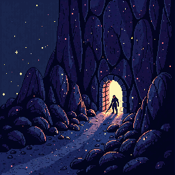

<p align="center">
  
</p>

<h1 align="center">A Dungeon in the Middle of Nowhere</h1>

<p align="center">
  A persistent, never-ending real-time action dungeon crawler built with <strong>Godot 4 + C#</strong>.<br/>
  Inspired by Diablo 1's atmosphere, loot chase, and town hub — reimagined as an infinite descent into a living dungeon that feeds on adventurers.
</p>

<p align="center">
  <strong>Status:</strong> In active development. Playable prototype with full game loop.
</p>

---

## How This Repo Was Built — A Real-World Experiment in AI+Human Natural-Language Programming

**Every line of code, every test, every pixel of art, and every design document in this repo was produced by AI — directed by a human product owner in natural-language conversation. The human has never written, edited, or debugged code in this repo.**

The human directs. The AI builds, tests, commits, and pushes. Specs are the source of truth.

### Why We're Doing This

We're exploring what happens when you push "vibe coding" — the casual, chat-driven interaction with AI — to its limit: can you build a non-trivial, shippable game entirely through directed conversation? Not by writing code yourself and having AI autocomplete, but by specifying the game in English and letting the AI figure out the implementation.

Three reasons this matters:

1. **It's the near-future of software.** Tools like Claude Code have reached a capability threshold where a skilled director can guide an agent through complex, multi-week projects. We want to know where this actually breaks.
2. **Games are a fair stress test.** They require code correctness, visual design, game feel, performance, and a functioning end-to-end experience. A broken game is obvious in a way that a half-broken SaaS app is not.
3. **Specs become source of truth.** When humans can't read the code fluently, the spec documents become the contract. If `docs/systems/combat.md` says a crit does 2x damage, the code must match — and the tests verify it. This flips the traditional relationship where code is truth and docs are a nice-to-have.

### How It Works

The human is the **product owner / client**:
- Directs in natural language: *"make the pause menu tabbed like Diablo 2"*, *"keyboard nav is broken in the shop — fix it"*
- Makes design decisions: *"Elemental, Aether, and Attunement — those are the three magic schools"*
- Approves or redirects outcomes: *"this feels off, try again"*
- Does not open `.cs` files. Does not write code.

The AI is the **entire dev team** — multiple specialized agents coordinated by a primary Claude Code session:
- **Design lead** writes specs when asked to design systems
- **QA lead** writes tests and reviews specs for gaps
- **DevOps lead** configures CI, Makefile, project scaffolding
- **Art lead** generates sprites, tiles, and animations via PixelLab
- **General-purpose agents** for exploration, research, parallel work

The primary session reads specs before touching code, writes tests before implementation, updates docs when behavior changes, commits to git with conventional format, and pushes to GitHub.

### The Spec-First Loop

```
Human:  "Make the Ranger class feel more tactical and whimsical in tone."
           ↓
AI:     Reads docs/world/class-lore.md and docs/systems/skills.md
        Proposes design changes in conversation
           ↓
Human:  "Yes, and call that ability 'Tip Toes' — Rangers name things whimsically."
           ↓
AI:     Updates docs/world/class-lore.md and docs/systems/skills.md
        Writes tests in scripts/testing/tests/*.cs
        Implements changes in scripts/**/*.cs
        Runs: make build && make test
        Commits: "feat(ranger): rewrite ability names with whimsical tone"
        Pushes to main
           ↓
Human:  Opens the game, tests it, says "good" or "no, do it differently"
```

### What Works, What Breaks

**Works well:**
- **Specs-first is real.** When the spec exists and is clear, the AI produces good code. When the spec is vague, the code is vague.
- **Decomposition via agents.** Delegating research, art, and QA to specialized agents scales the work in parallel.
- **Automated tests are non-negotiable.** Without them, the AI can't verify its own work and behavior drifts silently.

**Failure modes (and the guards we put in place):**
- **Scope creep** — AI loves to "improve" adjacent code. Guard: strict "stay in scope" rule, frequent human course-correction.
- **Hallucinated APIs** — AI invents method names that don't exist. Guard: read actual NuGet package docs and verify by grep before use.
- **Confident wrongness** — AI claims something works without testing. Guard: hard rules — run `make build`, run `make test`, test the game before claiming done.
- **Memory loss across sessions** — Claude Code compresses old context. Guard: dev journal, changelog, and spec docs that the AI re-reads fresh each session.

### For Developers Reading This Code

- Start with [`docs/overview.md`](docs/overview.md) (what the game is)
- Read [`docs/dev-journal.md`](docs/dev-journal.md) for the narrative history of every session
- Read [`docs/conventions/ai-workflow.md`](docs/conventions/ai-workflow.md) for the process rules
- Browse [`docs/systems/`](docs/systems/) for the game design specs (these drive implementation)
- Look at [`scripts/testing/tests/`](scripts/testing/tests/) for examples of how tests verify specs
- Every commit message is written by AI. The human wrote zero commit messages.

If you see code that looks weird, it's usually because the spec says it should work that way. Read the spec first.

### For Researchers Interested in AI-Driven Development

- Every session's work is logged in [`docs/dev-journal.md`](docs/dev-journal.md)
- [`CHANGELOG.md`](CHANGELOG.md) is an auditable record of what changed when
- Look for failure patterns: session entries that describe bugs, misunderstandings, course corrections — all are preserved

**Full write-up:** [`docs/development-paradigm.md`](docs/development-paradigm.md)

### A Note on Authorship

This repository was directed by a human who is not a software engineer. Every line of code, every test, every document, every sprite — all AI-generated — was shaped by hundreds of small decisions: which directions to pursue, which designs to reject, what feels right, what doesn't. The AI is powerful but not autonomous. Without continuous human direction, it drifts.

The human is Claude Code's **director**. The AI is its **hands**. Neither works alone.

We publish this repo publicly because we think the paradigm is worth examining — its strengths, its failure modes, what it produces, and what it can't do (yet).

---

## The Game

You control a single permanent character — **Warrior**, **Ranger**, or **Mage** — that grows stronger across all sessions. There are no rerolls. The dungeon descends infinitely with escalating difficulty, and the dungeon itself is a living entity that wants you to grow strong before it harvests you.

**Core features:**

- 3 classes with 80+ skills across melee, ranged, and magic
- Infinite progression — no level cap, diminishing returns but never zero growth
- Living dungeon — an intelligent entity that adapts to your play style
- Meaningful death — XP loss, inventory risk, gold buyout, revival negotiation
- Town hub with 5 NPCs — Shop, Blacksmith, Guild, Teleporter, Banker
- Procedural floors with zone-based themes and difficulty scaling
- Diablo-style HUD — HP/MP orbs, skill hotbar, XP progress bar
- Endgame systems — Dungeon Pacts, Zone Saturation, Magicule Attunement

## Screenshots

*Coming soon*

## Tech Stack

| Layer | Technology |
|-------|-----------|
| Engine | Godot 4.6 (.NET edition) |
| Language | C# / .NET 8+ |
| Renderer | GL Compatibility |
| Art | PixelLab AI + Screaming Brain Studios (CC0) |
| Platform | macOS (Apple Silicon + Intel), Windows, Linux |

## Quick Start

```bash
# Clone and build
git clone https://github.com/balbonits/infinite-dungeon-game.git
cd infinite-dungeon-game

# Export executables for all platforms (macOS, Windows, Linux)
make export-all

# Or export a single platform
make export-mac
make export-win
make export-linux

# Executables land in build/ (gitignored)
```

### Requirements

- [.NET 8+ SDK](https://dotnet.microsoft.com/download)
- [Godot 4.6 .NET edition](https://godotengine.org/download) with export templates installed
  - Open Godot → Editor → Manage Export Templates → Download and Install

### Run from Source

```bash
make build      # Compile C#
make run        # Build and launch in Godot
```

### Testing

```bash
make test                              # 315 unit + integration tests
make sandbox-headless SCENE=full-run   # Automated 3-class playthrough (54 assertions)
make sandbox-headless-all              # All 14 sandbox checks
```

### All Make Targets

```bash
# Build & Run
make build            # dotnet build
make run              # Build and launch in Godot

# Export
make export-all       # All 3 platforms → build/
make export-mac       # macOS → build/DungeonGame.app
make export-win       # Windows → build/DungeonGame.exe
make export-linux     # Linux → build/DungeonGame.x86_64

# Test
make test             # Unit + integration tests
make test-unit        # Unit tests only
make test-integration # Integration tests only
make sandbox SCENE=X  # Launch sandbox visually
make sandbox-headless SCENE=X  # Run sandbox headless

# Utilities
make status           # Git, build, Godot version
make doctor           # Check dev environment health
make clean            # Remove build artifacts
make kill             # Kill Godot processes
```

## Project Structure

```
scripts/
├── autoloads/          # GameState, EventBus, SaveManager
├── logic/              # Pure C# game logic (no Godot dependency)
│   ├── SkillDatabase.cs, SkillDef.cs, SkillBar.cs
│   ├── DungeonPacts.cs, ZoneSaturation.cs, DungeonIntelligence.cs
│   ├── MagiculeAttunement.cs, DepthGearTier.cs
│   ├── Inventory.cs, Item.cs, Bank.cs, Crafting.cs
│   └── SaveData.cs, SaveSystem.cs
├── ui/                 # All UI (GameWindow, TabBar, ScrollList, etc.)
└── *.cs                # Scene scripts (Player, Enemy, Dungeon, Town)

docs/                   # 80+ design docs, specs, and architecture
assets/                 # Sprites, tiles, projectiles, UI art
scenes/                 # Godot .tscn scene files
```

## Documentation

Extensive game design documentation lives in [`docs/`](docs/):

- **Game systems** — combat, leveling, stats, skills, magic, death, save
- **World design** — dungeon lore, town, monsters, zone themes
- **Architecture** — autoloads, signals, entity framework, tech stack
- **Endgame** — pacts, attunement, zone saturation, dungeon intelligence

## License

**Proprietary.** See [LICENSE](LICENSE) for terms.

This repository is public for viewing and educational purposes. The source code and original game assets may not be used in commercial products or redistributed. Third-party assets retain their original licenses — see [CREDITS.md](CREDITS.md).

## Credits

See [CREDITS.md](CREDITS.md) for full attribution of third-party assets and tools.

---

Made in Los Angeles, 2026.
